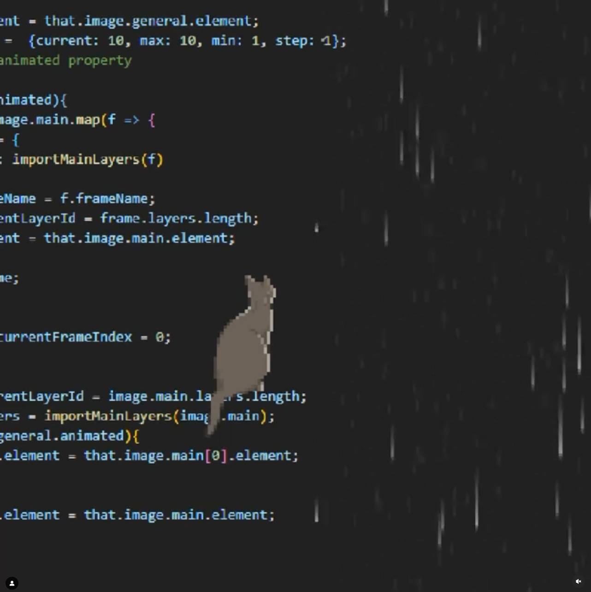

---
markmap:
    colorFreezeLevel: 3
    # maxWidth: 130
    # color: '#3E0973'
    # color: '#58088C'
    color: '#A63C9F'
   
---

# Hausaufgabe:   **"Im Moment"**

##  **Rest**

### Meditation
- app or tool?
- soundscape?
- notes or reminder function

### AudioVisual   animation
- [@v0id_scuy](https://www.instagram.com/v0id_scuy/?hl=en)
(instagram)

## <h3>Gif/Loop/   Wallpaper</h3>

### <h3>**Pixel art**</h3>
- Scene/Image ideas:
    - draw in photoshop/illustrator

    - [Pixelart-to-css](https://pixelartcss.com)
    
    - google for atmospheric
    landscapes/cozy images
  

- Inspiration:
    - [@aleha84](https://www.instagram.com/aleha_84/?hl=en)
    (instagram)
    
        - image creation 
        library thingy
        --> [github](https://github.com/aleha84/simple.canvas.core2?tab=readme-ov-file) 
        - 

### <h3>Wallpaper<h3>
- Tyler Pate   [@thecreativepain](https://www.instagram.com/thecreativepain/?hl=en)
    (instagram)

    - [Wallpapers](https://www.twelvesouth.com/pages/wallpaper-collection-8)

- Ideas:

  - like a page on website

  - vectorbased?

  - art style: 
    - -cartoon-y
    - -pixelated
    - -"lofi"

  - 2/3 different variants 
    (maybe seasons)

  - Illustrator (--> maybe
    convert to pixelart)

  - Convert to svg
    and create canvas
    (to animate/scale)

<!-- ### <h3> Combination Pixelart/Wallpaper </h3> -->

## <h3>Dokumentation</h3>
- max 900 chars 
    (with spaces) 

- s

- concepts/thoughts
    (exteinsively/detailed)

- if applicable:
    additional files for 
    more documenation